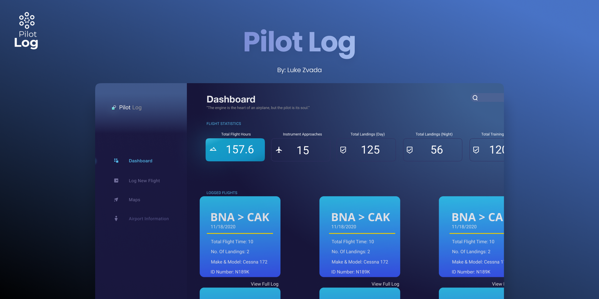

# PilotLog 

For my full stack capstone at Nashville Software School, I created an application that allows pilots to easily log flights, get real time METARS (weather), and current airport conditions in real time. I used React, Javascript, CSS, HTML, Material-UI, Python, Django, Chart.js, AVWX api (METARS & Airport Conditions)



### Setup
1. Clone this Repository
2. cd into that directory
3. Download packages:
```
npm install
npm i --save react react-dom react-router-dom
npm install @material-ui/core
npm install @material-ui/icons
npm install chart.js --save
```
4. ``` npm start ```
5. Follow this link (https://github.com/LukeZvada/pilotlogcapstone-server) to the backend repo for this project and follow remaining steps. 
